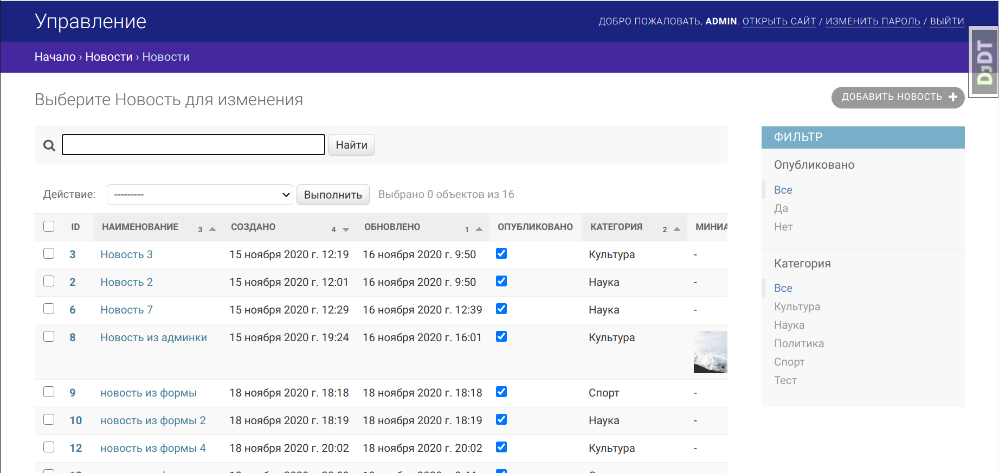
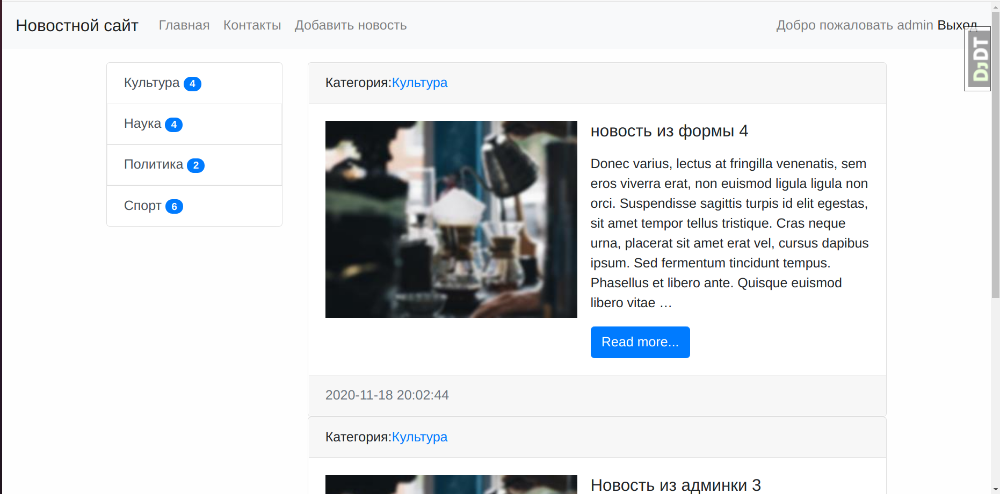

# DjangoLearning
Функционал:
 Создание новости(картирка+текст),
 Обратная связь,
 Фильтр по категориям,
 Регистрация,
 Авторизация,
 Установлена CAPTCHA,
 Установлен редактор при добавлении новости.
 
 
 Данные храняться в sqlite3, так же пробовал в mysql все работает.
 
 
 
 
 
 

